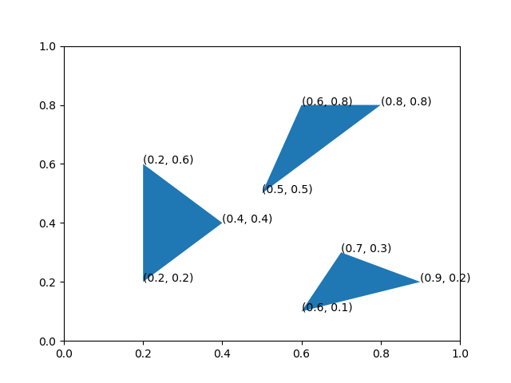

Organizing code for a Python project
====================================

A well structured project is
easy to navigate and make changes and improvements to.
It's also more likely to be used by other people --
and that includes *you* a few weeks from now!

Organization basics
-------------------

We want to write a Python program that draws triangles:

We use the the `Polygon <https://matplotlib.org/gallery/api/patch_collection.html>`_ class
of the `matplotlib <https://matplotlib.org/>`_ library
and write a script called ``draw_triangles.py`` to do this:

.. literalinclude:: ../code/draw_triangles-v1.py
   :caption: draw_triangles.py
   :language: python

Do you think this is a good way to organize the code?
What do you think could be improved in the script ``draw_triangles.py``?

Functions
^^^^^^^^^

Functions facilitate code reuse.
Whenever you see yourself
typing the same code twice
in the same program or project,
it is a clear indication that the code belongs in a function.

A good function:

* has a descriptive name. ``draw_triangle`` is a better name
  than ``plot``.
* is small -- no more than a couple of dozen lines -- and does
  **one** thing. If a function is doing too much,
  then it should probably be broken into smaller functions.
* can be easily tested -- more on this soon.
* is well documented -- more on this later.

In the script ``draw_triangles.py`` above,
it would be a good idea to define a function
called ``draw_triangle`` that draws a single triangle,
and re-use this function every time we need to draw a triangle:

.. literalinclude:: ../code/draw_triangles-v2.py
   :caption: draw_triangles.py

Python scripts and modules
^^^^^^^^^^^^^^^^^^^^^^^^^^

A *module* is a file containing a collection of Python definitions and statements,
typically named with a ``.py`` suffix.

A *script* is a module that is intended to be run by the Python interpreter.
For example, the script ``draw_triangles.py`` can be run
from the command-line using the command:

::

  $ python draw_triangles.py

If you are using an Integrated Development Environment
like Spyder or `PyCharm <https://www.jetbrains.com/pycharm/>`_,
then the script can be run by opening it in the IDE and clicking on the "Run" button.

Modules, or specific functions from a module can be imported
using the ``import`` statement:

.. code-block:: python

   import draw_triangles
   from draw_triangles import draw_triangle

When a module is imported,
all the statements in the module are executed by the Python interpreter.
This happens only the first time the module is imported.

It is sometimes useful to have both
importable functions
as well as executable statements
in a single module.
When importing functions from this module,
it is possible to avoid running other code by placing it under
``if __name__ == "__main__"``:

.. literalinclude:: ../code/draw_triangles-v3.py
   :caption: draw_triangles.py

When another module imports
the module ``draw_triangles`` above,
the code under ``if __name__ == "__main__"`` is **not** executed.

How to structure a Python project?
----------------------------------

Let us now imagine we had a lot more code;
for example, a *collection* of functions for:

* plotting shapes (like ``draw_triangle`` above)
* calculating areas
* geometric transformations

What are the different ways to organize code for a Python project
that is more than a handful of lines long?

A single module
^^^^^^^^^^^^^^^

::

   geometry
   └── draw_triangles.py

One way to organize your code
is to put all of it
in a single ``.py`` file (module)
like ``draw_triangles.py`` above.

Multiple modules
^^^^^^^^^^^^^^^^

For a small number of functions
the approach above is fine,
and even recommended,
but as the size and/or scope of the project grows,
it may be necessary to
divide up code into different modules,
each containing related data and functionality.

::

   geometry
   ├── draw_triangles.py
   └── graphics.py

.. literalinclude:: ../code/graphics.py
   :caption: graphics.py

Typically, the "top-level" executable code is put in
in a separate script
which imports functions and data from other modules:

.. code-block:: python 
   :caption: draw_triangles.py

   import graphics 

   graphics.draw_triangle([
       (0.2, 0.2),
       (0.2, 0.6),
       (0.4, 0.4)
   ])

   graphics.draw_triangle([
       (0.6, 0.8),
       (0.8, 0.8),
       (0.5, 0.5)
   ])

   graphics.draw_triangle([
       (0.6, 0.1),
       (0.7, 0.3),
       (0.9, 0.2)
   ])

Packages
^^^^^^^^

A Python **package** is a directory containing
a file called ``__init__.py``,
which can be empty.
Packages can contain modules
as well as other packages
(sometimes referred to as *sub-packages*).

For example, ``geometry`` below is a package,
containing various modules:

::

   draw_triangles.py
   geometry
   ├── graphics.py
   └── __init__.py

A module from the package can be imported
using the "dot" notation:

.. code-block:: python

   import geometry.graphics
   geometry.graphics.draw_triangle(args)

It's also possible to import a specific function
from the module:

.. code-block:: python
   
   from geometry.graphics import draw_triangle
   draw_triangle(args)

Packages can themselves be imported,
which really just imports the ``__init__.py`` module.

.. code-block:: python
   
   import geometry

If ``__init__.py`` is empty, there is "nothing" in the imported
``geometry`` package,
and the following line gives an error:

.. code-block:: python

   geometry.graphics.draw_triangle(args)

.. code-block:: python

   AttributeError: module 'geometry' has no attribute 'graphics'

Importing from anywhere
-----------------------

sys.path
^^^^^^^^

To improve their reusability,
you typically want to be able to
``import`` your modules and packages
from anywhere,
i.e., from any directory on your computer.

One way to do this
is to use ``sys.path``:

.. code-block:: python

   import sys
   sys.path.append('/path/to/geometry')

   import graphics

``sys.path`` is a list of directories
that Python looks for modules and packages in
when you ``import`` them.

Installable projects
^^^^^^^^^^^^^^^^^^^^

A better way is to make your project "installable"
using
`setuptools <https://setuptools.readthedocs.io/en/latest/>`_.
To do this, you will need to
include a ``setup.py`` with your project.
Your project should be organized as follows:

.. code-block:: bash

   draw_triangles.py
   geometry
   ├── graphics.py
   └── __init__.py
   setup.py

A minimal ``setup.py`` can include the following

.. code-block:: python 
   :caption: setup.py

   from setuptools import setup

   setup(name='geometry',
      version='0.1',
      author='Ashwin Srinath',
      packages=['geometry'])

You can install the package using ``pip``
with the following command
(run from the same directory as ``setup.py``):

.. code-block:: bash

   $ pip install -e . --user

This installs the package in *editable* mode,
creating a link to it in the user's ``site-packages`` directory,
which happens to already be in ``sys.path``.

Once your project is installed,
you don't need to worry about
adding it manually to ``sys.path`` each time you need to use it.

It's also easy to *uninstall* a package;
just run the following command from the same directory as ``setup.py``:

.. code-block:: bash
   
   $ pip uninstall .
